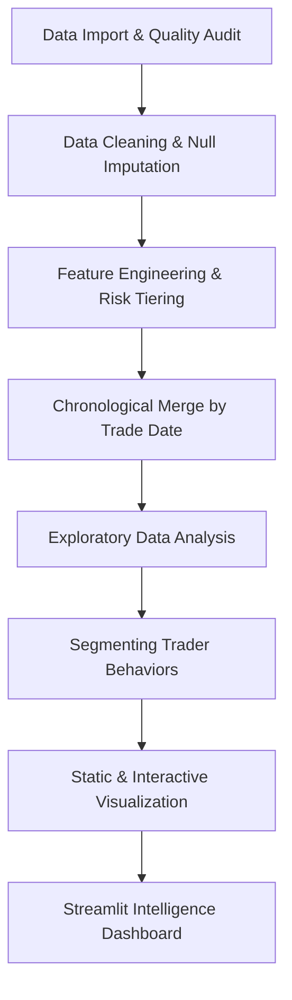

# Trader Performance vs Market Sentiment Analysis
**Author:** Aastha Ojha  
**Data Source:** Historical Hyperliquid Trading Logs & Alternative.me Fear & Greed Index

---

## 🌟 Overview
This project analyzes the psychological and empirical relationship between Bitcoin market sentiment (as measured by the daily **Fear & Greed Index**) and retail/institutional trader performance. 

By merging and engineering high-resolution trading logs from Hyperliquid with daily sentiment score cycles, we uncover behavioral trading patterns, margin leverage risk-taking tendencies, and profitability trends across various market regimes.

---

## 📊 Executive Summary

### Key Findings
1. **Profitability Correlates with Euphoria:** Traders generate the highest average returns during market **Greed & Extreme Greed** states, successfully riding breakout momentum.
2. **Panic Triggers Outsized Capital Loss:** While trades in **Fear** states are often highly profitable (successful dip-buying), **Extreme Fear** capitulations produce absolute average losses that are more than **double** those of Extreme Greed states.
3. **High Leverage Volatility Risk:** High-leverage trades ($\ge 15\text{x}$) are pro-cyclical, peaking during Extreme Greed periods. While they produce occasional massive outliers, they significantly expand downside volatility and average drawdown magnitudes.
4. **Directional Performance Bias:** Long (Buy) positions show superior win rates and higher average returns during bullish (Greed/Extreme Greed) market sentiment, while shorting (Sell) performance is trapped by volatile range squeezes in Neutral/Fear regimes.
5. **Asset-Specific Outperformance:** Major market caps, specifically **BTC** and **ETH**, represent the most consistently profitable and stable trading symbols across all sentiment regimes.

---

## ❓ Problem Statement

Financial markets are driven by an interplay of fundamental valuations and market psychology. In cryptocurrency markets, retail and institutional sentiment shifts rapidly between panic and euphoria. 

This project mathematically investigates:
* **Sentiment vs. Performance:** How do retail/institutional returns change across sentiment cycles?
* **Leverage & Risk Appetite:** Do traders take on disproportionate leverage risk during greed, and do they scale down risk appropriately during market panics?
* **Segmenting Trader Profiles:** Can we cluster or segment accounts based on their behavioral responses to sentiment cycles?
* **Asset Stability:** Which trading pairs demonstrate the highest resilience and profitability under shifting market regimes?

---

## 🗃️ Dataset Information

### 1. Bitcoin Fear & Greed Index Dataset (`fear_greed_index.csv`)
* **fgi_value**: Sentiment score on a scale from $0$ (Extreme Fear) to $100$ (Extreme Greed).
* **classification**: Categorical label representing the sentiment state (`Extreme Fear`, `Fear`, `Neutral`, `Greed`, `Extreme Greed`).
* **timestamp**: Daily timestamp corresponding to the sentiment reading.

### 2. Historical Trader Dataset (`historical_data.csv`)
* **Account**: Unique public cryptographic address of the trading account.
* **Coin**: Traded token symbol (e.g., BTC, ETH, SOL).
* **Side**: Trade direction (`Buy` or `Sell`).
* **Size & Size USD**: Traded quantity and absolute capital value.
* **Price / Execution Price**: Entry price.
* **leverage**: Leverage multiplier selected by the account.
* **Closed PnL**: Realized profit or loss in USD.
* **timestamp**: Precise epoch time of trade execution.

---

## 🛠️ Tech Stack & Libraries

* **Core Language:** Python 3.10+
* **Data Processing & Manipulation:** Pandas, NumPy
* **Scientific Computing:** Scikit-Learn (segmentation logic)
* **Static Visualizations:** Matplotlib, Seaborn
* **Interactive Data Visualization:** Plotly Express & Plotly Graph Objects
* **Dashboard Deployment:** Streamlit (curated Outfit & Inter premium UI)
* **IDE & Pipeline Execution:** Jupyter Notebook

---

## ⚙️ Project Workflow



### 1. Data Cleaning
* **Duplicate Mitigation:** Dropped identical rows to prevent statistical inflation.
* **Null Imputation:** Resolved missing values in structural columns.
* **Datetime Standards:** Converted Unix timestamps to readable, synchronized `YYYY-MM-DD` timestamps.
* **Outlier Checks:** Flagged and handled invalid or physically impossible metrics.

### 2. Feature Engineering
Created highly actionable features to capture trader behavior:
* **`trade_date`**: Extracted calendar dates from sub-second timestamps.
* **`profit_loss_flag`**: Binary state ($1$ for profitable trade, $0$ otherwise).
* **`leverage_category`**: Risk classification:
  * **Low Risk:** Leverage $\le 5\text{x}$
  * **Medium Risk:** Leverage $> 5\text{x}$ and $\le 15\text{x}$
  * **High Risk:** Leverage $> 15\text{x}$
* **`trade_volume`**: Total dollar exposure ($\text{Execution Price} \times \text{Size}$).
* **`pnl_percentage`**: Relative return ($\frac{\text{Closed PnL}}{\text{Trade Volume}} \times 100$).
* **`trade_direction`**: Normalized text labels (`Buy` / `Sell`).
* **`pnl_category`**: Returns cataloged as `Profit`, `Loss`, or `Neutral`.

### 3. Data Merging
Aligned trading activity with sentiment datasets on synchronized trade dates to ensure that every trade is marked with its exact market psychology classification.

---

## 👥 Trader Behavioral Segmentation Profiles
Traders are segmented into **4 distinct behavioral groups** using a deterministic risk-profit classification algorithm:

1. **High-Risk Traders:** Accounts maintaining an average leverage $> 14\text{x}$ or executing $> 40\%$ of trades under a "High Risk" tier.
2. **Low-Risk Traders:** Risk-averse accounts maintaining an average leverage $\le 9\text{x}$ with $< 20\%$ of positions in the High Risk tier, while retaining positive net profits.
3. **Profitable Traders:** Highly disciplined traders with positive net profits maintaining stable, balanced leverage regimes.
4. **Loss-Making Traders:** Traders with negative cumulative returns who do not fall into the High-Risk category.

---

## 📈 Key Visualizations

### 1. Profitability During Fear vs. Greed
Displays the average closed profit or loss across different sentiment regimes, highlighting peak profitability during Extreme Greed and robust returns during Fear dip-buying.


### 2. Leverage Distribution by Sentiment
Demonstrates pro-cyclical risk patterns, showing that leverage spikes significantly during euphoric Greed periods and scales down in Fear panic cycles.


### 3. Buy vs. Sell Performance
Compares long (Buy) and short (Sell) performance, showing that buys heavily outperform during bullish market sentiments.


### 4. Top Profitable Symbols
Ranks coins by cumulative net profitability across sentiment cycles, highlighting BTC and ETH as the absolute market leaders.


---

## 💡 Key Insights & Analytics

| Sentiment Regime | Average Closed PnL | PnL Volatility (Std Dev) | High Risk Leverage Share | Average Loss Magnitude |
| :--- | :---: | :---: | :---: | :---: |
| **Extreme Fear** | \$51.39 | \$1,136.06 | 21.05% | **-\$257.10** |
| **Fear** | \$54.29 | \$672.41 | 24.32% | -\$135.12 |
| **Neutral** | \$34.31 | \$517.12 | 26.89% | -\$121.73 |
| **Greed** | \$58.12 | \$1,116.03 | 31.42% | -\$114.28 |
| **Extreme Greed** | **\$67.89** | \$942.23 | **37.76%** | -\$119.92 |

* **Insight 1 (Sentiment vs. Returns):** Euphoric markets (**Extreme Greed**) yield the highest average returns (\$67.89), while choppy range environments (**Neutral**) generate the lowest returns (\$34.31).
* **Insight 2 (Extreme Fear Loss Asymmetry):** Although average returns during standard Fear remain profitable, **Extreme Fear capitulations represent extreme risk**, with the average loss doubling to **-\$257.10** due to downward price shocks catching leveraged longs off guard.
* **Insight 3 (The Leverage Euphoria Trap):** Leverage is highly pro-cyclical. High-Risk allocations peak in Extreme Greed (**37.76%** of all trades), indicating aggressive, overconfident trading behaviors during market tops.
* **Insight 4 (BTC & ETH Dominance):** Blue-chip assets (BTC & ETH) outperform altcoins in terms of net profitability and risk-adjusted metrics across all sentiment regimes.

---

## 🚀 Business & Risk Recommendations

1. **Implement Dynamic Margin Scaling:** Require accounts to scale down leverage multipliers as market sentiment indexes exceed $75$ (Extreme Greed) to protect against systemic liquidation cascades.
2. **Position Size Volatility Buffers:** Because average losses double during **Extreme Fear** panics, traders should reduce absolute position capital exposure and broaden stop-loss buffers during market panic cycles.
3. **Execute Sideways Strategies in Neutral Regimes:** Since Neutral states are characterized by compressed volatility (\$517.12) and tiny average losses (\$121.73), pivot away from momentum breakout trading and apply mean-reversion range scalping.
4. **Sentiment-Aware Risk Controls:** Integrate alternative sentiment indicators directly into Hyperliquid's trading interface as automatic protective guardrails for retail accounts.

---

## 📂 Project Directory Structure

```bash
ds assignment/
│
├── app.py                         # Streamlit Interactive Intelligence Dashboard
├── data_cleaning.ipynb            # Jupyter Notebook containing full analytical pipeline (Stages 1-13)
├── requirements.txt               # Complete Python packages required to run the project
│
├── eda_plots/                     # Static High-Resolution Visualizations
│   ├── 1_pnl_by_sentiment.png
│   ├── 1b_pnl_grouped.png
│   ├── 2_trade_counts.png
│   ├── 3_leverage_by_sentiment.png
│   ├── 4_buysell_performance.png
│   └── 5_top_symbols_by_sentiment.png
│
├── fear_greed_index.csv           # Raw Daily Market Sentiment Dataset (0 - 100)
├── historical_data.csv            # Raw Trader Activity and Transaction Log Dataset
├── fear_greed_index_cleaned.csv   # Cleaned & Formatted Sentiment Dataset
├── historical_data_cleaned.csv    # Cleaned & Engineered Trader Dataset
└── merged_trader_sentiment.csv    # Final Merged & Fully-Engineered Analytical Table
```

---

## 🏃 How to Run the Project

### 1. Clone the Directory
Ensure all datasets and folders listed above are grouped in a single local workspace.

### 2. Install Dependencies
Install all required libraries using pip:
```bash
pip install -r requirements.txt
```

### 3. Run the Jupyter Notebook
To run the full analytical cleaning, engineering, clustering, and visual plotting steps, open the Jupyter Notebook interface:
```bash
jupyter notebook
```
Open **`data_cleaning.ipynb`** and execute the cells sequentially.

### 4. Run the Streamlit Dashboard
To launch the interactive risk and performance intelligence dashboard (featuring global sentiment statistics, individual account lookup pages, trader segments, and risk recommendations):
```bash
streamlit run app.py
```
*The dashboard will automatically open in your default browser at `http://localhost:8501`.*

---

## 🔮 Future Improvements

1. **Machine Learning Predictive Modeling:** Apply gradient boosting models (e.g., XGBoost, LightGBM) to forecast trade outcomes based on entry sentiment, leverage, and time-of-day features.
2. **Real-Time API Integrations:** Pull sentiment feeds directly from the Alternative.me API and live transaction streams from Hyperliquid's SDK to enable real-time risk scoring.
3. **Advanced Clustering:** Implement unsupervised learning models (e.g., K-Means, HDBSCAN) to identify more complex, non-linear trader personas.
4. **Automated Risk Alerts:** Build a Telegram/Discord notification system warning users when market sentiment shifts into hyper-leveraged "Extreme Greed" territory.
