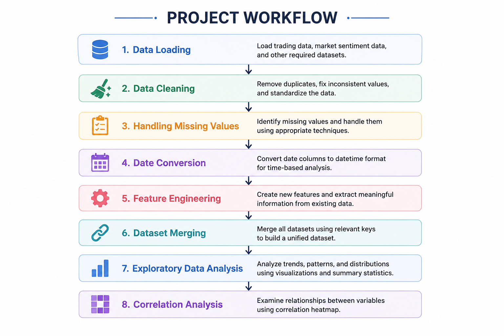
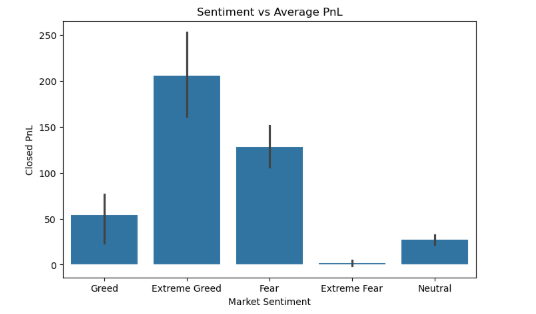
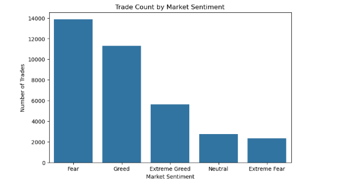
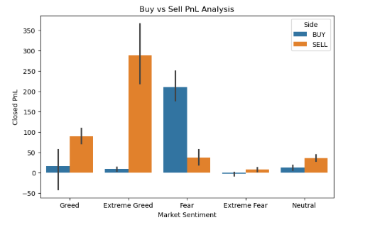
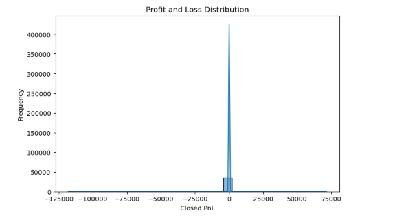
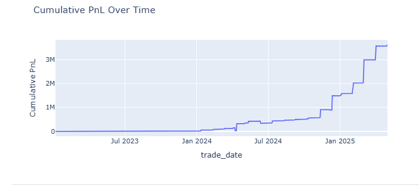
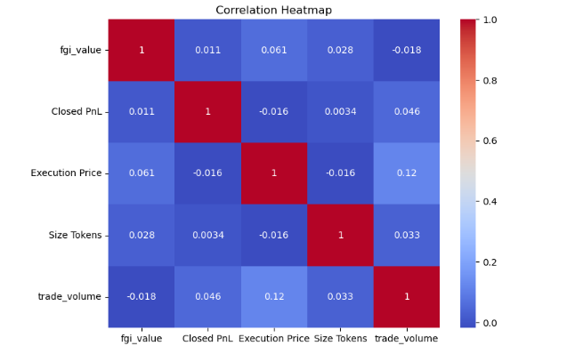

## Crypto Trading Data Analysis using Market Sentiment
**Author:** Aastha Ojha  

---

#### Project Overview

This project analyzes historical crypto trading data together with Bitcoin Fear & Greed Index sentiment data.

The project focuses on:
- data cleaning
- preprocessing
- feature engineering
- dataset merging
- exploratory data analysis (EDA)
- visualization using Matplotlib, Seaborn, and Plotly

The goal is to understand how market sentiment relates to trading activity and profit/loss behavior.
---
## Datasets Used

### 1. Fear & Greed Dataset

This dataset contains daily Bitcoin market sentiment information.

Main columns:
- `date` → date of sentiment score
- `value` → sentiment score from 0 to 100
- `classification` → sentiment category such as Fear, Greed, Extreme Fear, and Extreme Greed

This dataset helps analyze overall market psychology.

### 2. Historical Trading Dataset
This dataset contains historical crypto trading records.

Main columns:
- `Coin` → cryptocurrency traded
- `Side` → Buy or Sell trade
- `Execution Price` → trade execution price
- `Size Tokens` → quantity traded
- `Closed PnL` → realized profit or loss
- `Timestamp IST` → date and time of trade execution

This dataset is used to analyze trader activity and trading performance.

---
## Technologies Used

- Python
- Pandas
- NumPy
- Matplotlib
- Seaborn
- Plotly
- Jupyter Notebook

---

## Project Workflow

#### Workflow Diagram

#### 1. Data Loading
The datasets were loaded into Pandas dataframes for further preprocessing and analysis.

#### 2. Data Cleaning
Duplicate records and invalid entries were removed to improve overall data quality.

#### 3. Handling Missing Values
Missing or null values were identified and handled appropriately to avoid issues during analysis.

#### 4. Date Conversion
Date and timestamp columns were converted into datetime format for time-based operations and trend analysis.

#### 5. Feature Engineering
New useful features such as trade volume and profit/loss category were created from existing columns.

#### 6. Dataset Merging
The trading dataset was merged with the Fear & Greed sentiment dataset using trade dates.

#### 7. Exploratory Data Analysis
EDA was performed to analyze trading patterns, profitability trends, and market sentiment behavior using visualizations.

#### 8. Correlation Analysis
Correlation analysis was used to study relationships between important numerical features such as trade volume, execution price, and profit/loss.

---
## Feature Engineering

The following features were created during preprocessing:

- `trade_date`  
  Extracted from timestamp to perform date-wise analysis and track trading activity over time.

- `pnl_category`  
  Categorized trades as Profit or Loss to simplify profitability analysis and comparison.

- `trade_volume`  
  Calculated using execution price and trade size to measure the total value of each trade.

---
## Visualizations

### Average PnL by Market Sentiment

---

### Trade Count Analysis

---

### Buy vs Sell Analysis

---

### Closed PnL Distribution

---

### Cumulative PnL Trend

---

### Trading Activity Over Time

---

### Correlation Heatmap

---

## Key Insights

- Trading activity changes significantly under different market sentiment conditions. The highest number of trades is observed during Fear and Greed phases, indicating increased market participation during volatile market conditions.

- Extreme Greed market conditions show the highest average profitability, while Extreme Fear conditions generate the lowest average returns. This suggests that market sentiment has a noticeable impact on trading outcomes.

- Buy and Sell trades perform differently across sentiment categories. Sell trades show stronger profitability during Extreme Greed phases, while Buy trades perform better during Fear market conditions.

- The cumulative PnL trend shows strong growth over time, especially during late 2024 and early 2025, where overall trading profitability increases rapidly.

- Trade activity becomes more volatile over time, with several large spikes in daily trade counts observed during later trading periods.

- The profit and loss distribution shows that most trades generate smaller profit/loss values, while a few trades produce extremely large gains or losses, indicating the presence of outliers in the dataset.

- Correlation analysis shows weak linear relationships between most numerical features, suggesting that trading profitability is influenced by multiple factors rather than a single variable.

- The pairplot analysis further confirms high variability in trade volume, market sentiment, and profit/loss values across the dataset.